# Project Report: Automated Surface Scratch Detection

**Introduction and Problem Statement**

The objective of this project was to develop a computer vision model capable of identifying surface defects. Specifically, the model is designed to classify input images as either "Good" (defect-free) or "Bad" (containing scratches), leveraging a provided dataset of 5,180 images and their corresponding label masks.

**Dataset Analysis and Preprocessing**

A comprehensive analysis of the dataset revealed a significant class imbalance across the 5,180 samples, with 4,177 "Good" samples (80.33%) compared to only 1,023 "Bad" samples (19.67%). This disparity highlighted the immediate need for data balancing to prevent the model from biasing towards the majority class.

To address this class imbalance, a targeted augmentation strategy was implemented. Geometric transformations—including flips, rotations, and translations—were applied exclusively to the minority "Bad" class. These specific augmentation techniques were selected because they preserve the essential structural features of the anomalies while generating realistic variations. This process successfully balanced the dataset, ensuring fair and effective downstream model training.

**Model Selection and Experimental Strategy**

Once I had the balanced dataset, I started thinking about the approaches I could use to build the model.

Following the general pattern, I split my dataset into train, validation, and test sets. The validation set was used for model selection between CNN-based and Transformer-based models, with the best model finally evaluated on the test set.

My first thought was, "Why not just use CNN-based models?" I could use classical architectures such as ResNet50, MobileNet, and InceptionV3. So, I started working on that.

Before actually trying different models, I fixed the training configuration to ensure a better and fair evaluation.

**Training Configuration:**
*   Epochs: 50
*   Batch size: 32
*   Learning rate: 0.0001

Early Stopping was set up to prevent overfitting and to save the best model weights.

So, I started with ResNet50, InceptionV3, and MobileNetV3. I trained them, and boom, got these graphs:

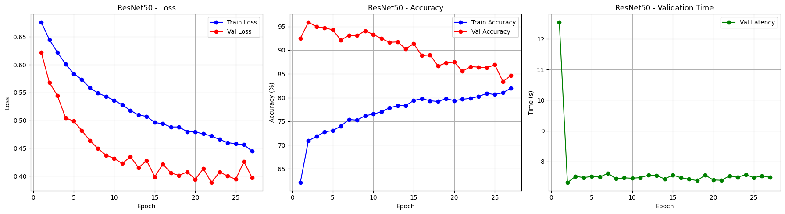
  

  
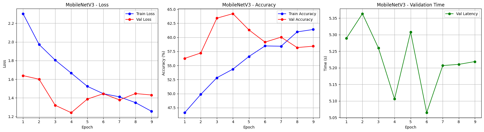
  

I noticed distinct behaviors across the three architectures that highlight the trade-offs between speed and stability. **ResNet50 is the strongest performer** but behaves unusually with validation accuracy consistently beating training accuracy, a classic sign of heavy data augmentation (like CutMix) making the training set "harder" than the validation set. In contrast, **MobileNetV3 proves to be the fastest model ($\approx 5s$ latency)** but struggles with stability, evident in its jagged, "bouncing" loss curves, suggesting the learning rate might be too aggressive for its lightweight structure. Finally, **InceptionV3 is the slowest and shows the clearest signs of overfitting**, where the validation loss begins to rise while training loss continues to fall, indicating it has started memorizing the data rather than learning generalizable features like ResNet did.

While scrolling through the web, I saw multiple Transformer-based models and thought, "Why not try them out?" So, I started working on them.

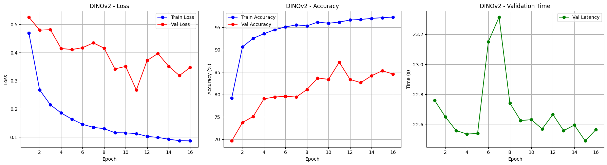
  
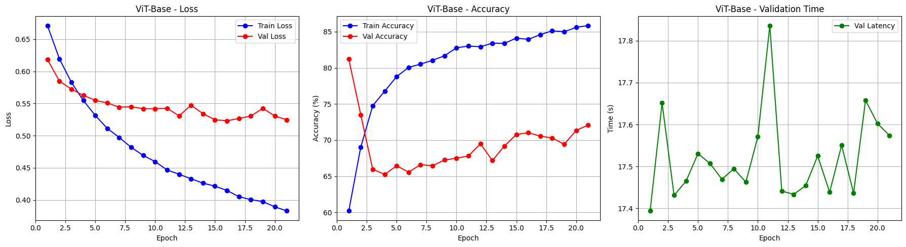
  
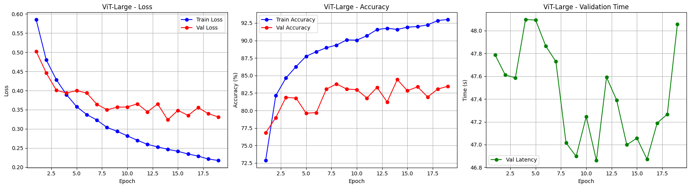
  
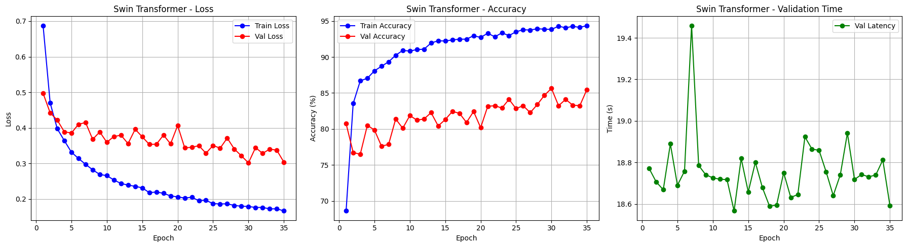
  
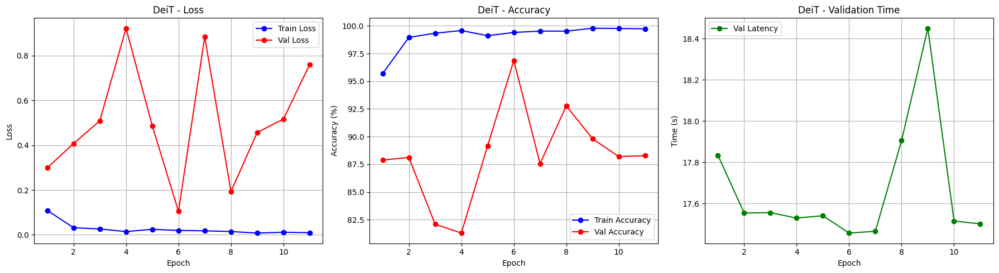
  

**Comparative Analysis: Transformers vs. CNNs**

Comparing the results of both model types yielded surprising findings: **Transformer-based models generally outperformed their CNN counterparts.**

**Model Comparison (Validation Set)**

| Model | Type | Accuracy | Precision | Recall | F1 Score | Inference Time (s) |
| :--- | :--- | :--- | :--- | :--- | :--- | :--- |
| **DeiT** | Transformer | **0.8828** | 0.8101 | **1.0000** | **0.8951** | 17.60 |
| Swin Transformer | Transformer | 0.8547 | 0.7916 | 0.9631 | 0.8689 | 18.73 |
| ResNet50 | CNN | 0.8467 | 0.7776 | 0.9711 | 0.8637 | 7.57 |
| DINOv2 | Transformer | 0.8459 | 0.7718 | 0.9823 | 0.8644 | 22.98 |
| ViT-Large | Transformer | 0.8347 | 0.7697 | 0.9551 | 0.8524 | 46.46 |
| ViT-Base | Transformer | 0.7207 | 0.6536 | 0.9390 | 0.7708 | 17.85 |
| InceptionV3 | CNN | 0.6340 | 0.5903 | 0.8764 | 0.7054 | 10.31 |
| MobileNetV3 | CNN | 0.5843 | 0.5618 | 0.7657 | 0.6481 | 5.01 |

Here are some key insights derived from comparing CNN and Transformer architectures:

  

Below is the confusion matrix for the best-performing Transformer model (DeiT):

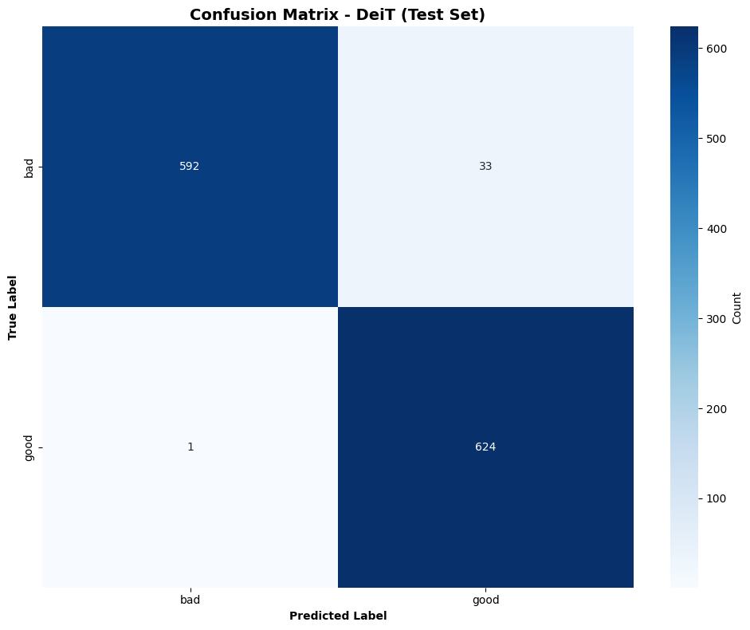
  

**Defect Localization and Ensemble Strategy**

With a robust classification model in place, the next logical step was defect localization—identifying the exact region of the scratch. For this task, I employed **YOLOv11**. To prepare the training data, I utilized the provided label masks to extract the bounding box coordinates of the scratches, converting the dataset into the standard YOLO format.

After training the object detection model, I devised an **ensemble strategy** to minimize the error rate by combining classification and detection outputs. The pipeline categorizes images into three distinct buckets:

1.  **Human Review:** Images that are ambiguous. This includes cases where the classifier predicts "Good" but the detector finds a scratch (Good + Scratches), or where confidence scores are low.
2.  **Bad:** Images confirmed as defective. This includes cases where the classifier predicts "Bad" and the detector confirms a scratch with high confidence.
3.  **Good:** Images confirmed as defect-free. This includes cases where the classifier predicts "Good" with high confidence and no scratch is detected.

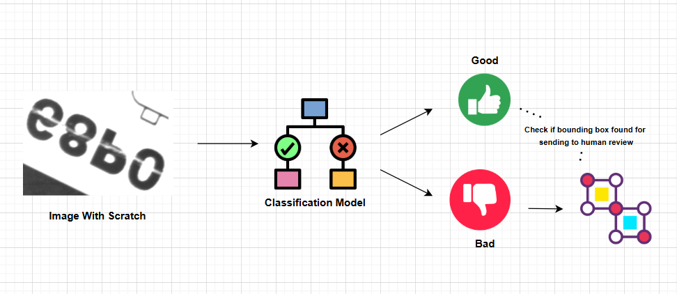
  

Some sample outputs from the detection model:

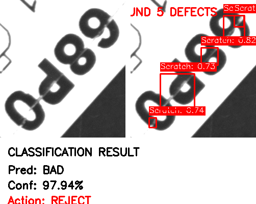
  
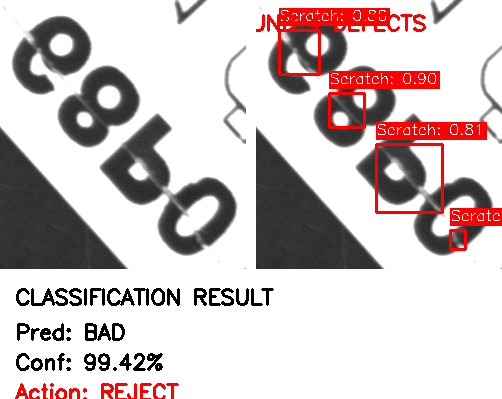
  
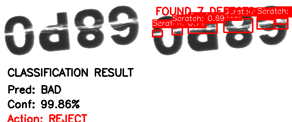
  

This multi-stage pipeline approach effectively addressed the challenge of accurate scratch detection, balancing automation with necessary human oversight for edge cases.

**Advanced Data Generation: Beyond Standard Augmentation**

The next major task was to figure out ways to **increase the dataset size of bad images beyond typical data augmentation techniques.**

There are basically two approaches which came to my mind instantly:

1.  **Synthetic Data Generation Using GANs**
2.  **3D Simulation & Diffusion:** A novel approach I learned during my internship, which involves creating a 3D model of the scratch, generating edge/depth/segmentation maps, and then passing them to a diffusion-based model to convert the simulated image into a photorealistic one.

For the GAN approach, I experimented with two specific architectures:

1.  **StyleGAN2:** I trained this on 1,000 images at 64x64 resolution. It took a solid 10 hours, but the results were promising:
      
    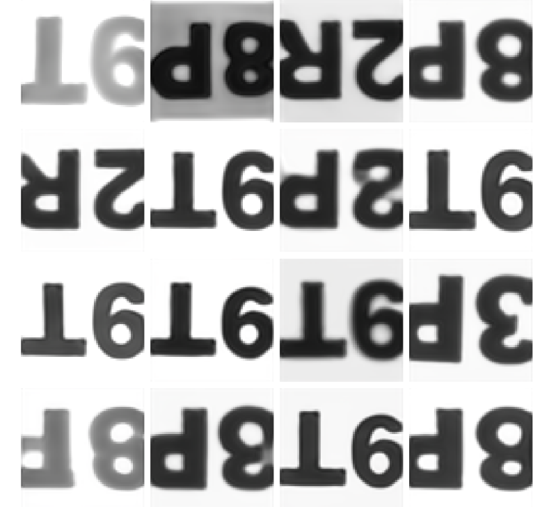
      

2.  **CycleGAN:** This cyclic discriminator-generator approach allowed for unpaired image-to-image translation, leading to results like this:
      
    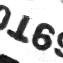
      
    
      

**Deployment and Optimization**

Once the modeling was complete, my main concern was **how to optimize the inference speed**, which is critical for the deployment stage.

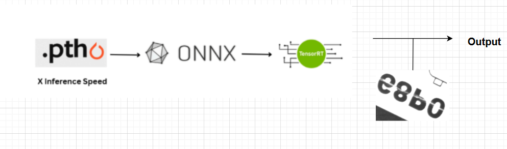
  

The process begins with a model trained in PyTorch (saved as a `.pth` file), which is then converted to the **ONNX format** to make it framework-independent and suitable for deployment. Next, the ONNX model is optimized using **NVIDIA TensorRT**, which significantly accelerates inference, achieving up to **10× faster speed** compared to the original PyTorch model.

## Inference Benchmark Results

Benchmark Date: **November 26, 2025 - 03:13:26**  
Test Images: **100 images**

| Model Type | Avg Time (ms) | Median Time (ms) | Std Dev (ms) | FPS | Speedup vs PyTorch |
|:-----------|:-------------:|:----------------:|:------------:|:---:|:------------------:|
| **PyTorch** | 9.40 | 8.98 | 1.39 | 106.4 | 1.00× (baseline) |
| **ONNX** | 8.67 | 8.34 | 0.75 | 115.3 | **1.08× faster** |
| **TensorRT** | 3.49 | 3.40 | 0.45 | 286.5 | **2.69× faster** |

### Key Findings

- **ONNX Runtime** provides a modest **8% speedup** over PyTorch with better consistency (lower std deviation)
- **TensorRT** delivers exceptional performance with **2.7× speedup**, achieving nearly **3× the FPS** of the PyTorch baseline
- TensorRT's optimizations result in **sub-4ms inference times**, making it ideal for real-time applications
